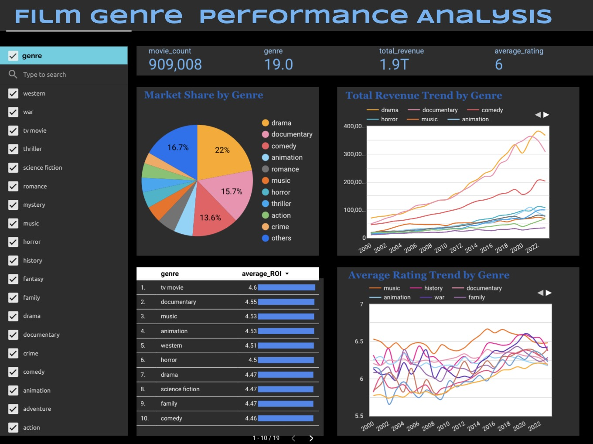

# Film Genre Insights Dashboard Project

## Overview

This project analyzes a wide collection of movie data to identify patterns, trends, and financial outcomes by genre. It employs a data pipeline to process and warehouse movie information, subsequently making this data accessible through a structured dashboard. The project is geared toward uncovering detailed trends in movie performance, with a focus on genre popularity, revenue, and critical reception over various periods. 

## Objectives

- To leverage data engineering and analytics skills to construct a robust data pipeline that processes and visualizes movie data.
- To provide a dashboard that offers insightful visualizations on movie genres, highlighting their revenue, ratings, and trends over time, thus facilitating a nuanced understanding of their market performance.


## Technologies Used

- **Cloud Platform**: GCP (Google Cloud Platform)
- **Data Warehouse**: BigQuery
- **Batch Processing**: PySpark on Dataproc
- **Dashboard Tool**: Looker Studio
- **Infrastructure as Code (IaC)**: Terraform 
- **Containerization**: Docker 
- **Workflow Orchestration**: Prefect 

## Dataset

The dataset in use is the [Full TMDB Movies Dataset 2024](https://www.kaggle.com/datasets/asaniczka/tmdb-movies-dataset-2023-930k-movies), a rich compilation from TMDB with details on 1,000,000 movies including ID, Title, Vote Average, Vote Count, Status, and more. Updated daily, it ensures fresh insights into movie trends and performances.

## Implementation

### File Upload

The dataset is fetched from Kaggle using the Kaggle API and uploaded to Google Cloud Storage (GCS). The processed data is stored in Parquet format and then loaded into Google BigQuery for further analysis and querying.

### Data Processing

The project uses PySpark for data processing, including:

- Removing duplicate records based on movie IDs.
- Handling missing values by either removal or imputation with medians.
- Handling outliers by filtering records beyond 3 standard deviations.
- Exploding the genres field to analyze movies by individual genres.

### Data Analysis

Key analyses conducted include:

- **Genre Distribution Analysis**: Aggregating movies by genre to calculate the count, average rating, and total revenue.
- **Temporal Trend Analysis**: Examining the yearly distribution of movies by genre, including the count, average rating, and total revenue.
- **Budget and Revenue Analysis**: Analyzing the relationship between movie budgets and revenues, including ROI calculations.


### Dashboard Visualization using Looker Studio

[Click here to access the live dashboard](https://lookerstudio.google.com/reporting/d5fb5557-72af-4e24-ac41-3432c7a87666)

[](https://lookerstudio.google.com/reporting/d5fb5557-72af-4e24-ac41-3432c7a87666)


## How to Run
Before running the project, ensure you have modified [`kaggle.json`](kaggle/kaggle.json) (Kaggle API key), [`credentials.json`](credentials.json) (GCP credentials), and other project-specific parameters in your repository as needed.

1. Install Terraform (if not already installed)
    ```bash
    brew install terraform
    ```

2. Initialize Terraform
    ```bash
    terraform init
    ```

3. Apply the Terraform configuration to create a storage bucket and dataset on GCP
    ```bash
    terraform apply
    ```

4. Build the Docker container
    ```bash
    docker build --no-cache -t film-genre-insights .
    ```

5. Run the Docker container
    ```bash
    docker run film-genre-insights
    ```
This command runs a Docker container from the `film-genre-insights` image, setting up an environment for the data pipeline. The [`run_movie_data_pipeline.sh`](run_movie_data_pipeline.sh) script inside the container prepares the data, creates a Dataproc cluster on Google Cloud Platform, and submits a Spark job for processing. After successful execution of the data pipeline, three tables will be generated in BigQuery for dashboard visualization purposes: `average_roi_by_genre`, `genre_distribution`, and `time_trend_analysis`. 


